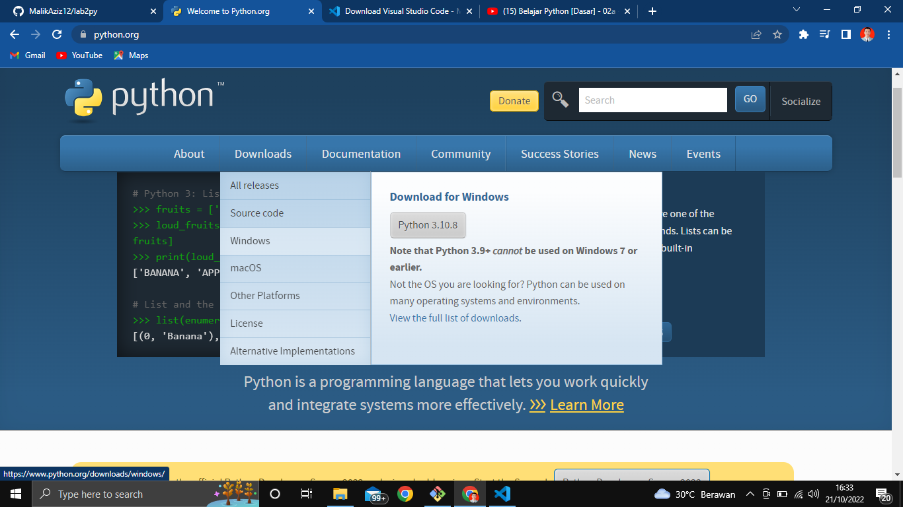
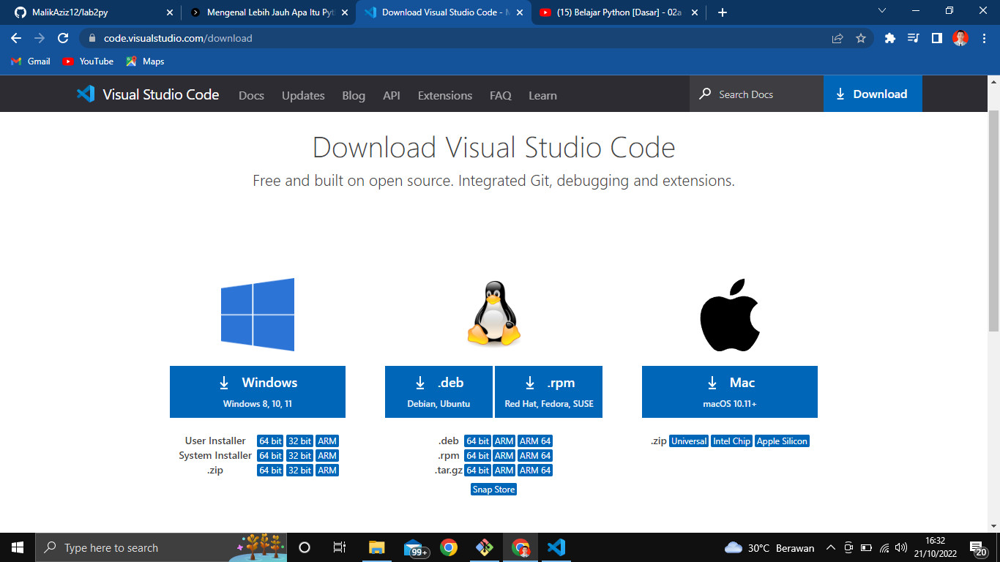
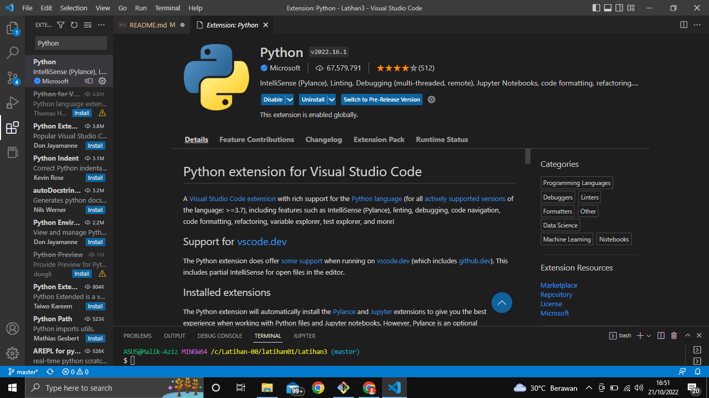
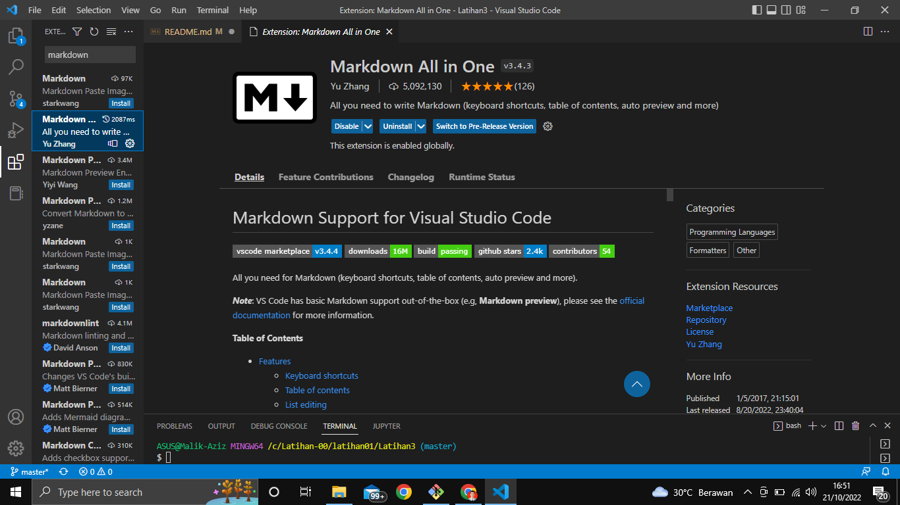
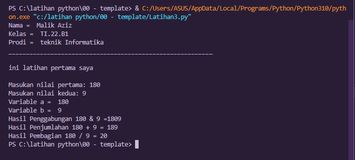

# Belajar bahasa pemrograman python untuk pemula

daftar isi :

  

- [Belajar bahasa pemrograman python untuk pemula](#belajar-bahasa-pemrograman-python-untuk-pemula)
- [Apa Itu Python?](#apa-itu-python)
- [Latihan 1](#latihan-1)
- [Latihan 2](#latihan-2)
- [Latihan 3](#latihan-3)

# Apa Itu Python?
Python adalah sebuah bahasa pemrograman yang digunakan untuk membuat aplikasi, perintah komputer, dan melakukan analisis data. Sebagai general-purpose language, Python bisa digunakan untuk membuat program apa saja dan menyelesaikan berbagai permasalahan.

**Berikut cara instlasinya**
1. Download python di laman web resminya [download python](https://www.python.org/)

Anda bisa langsung memilih versi os anda.
2. Instalasi python hingga selesai [python instalasi](https://www.youtube.com/watch?v=OSmaWPSgvTQ)

Setelah itu saya akan menggunkan teks editor dari visual studio code.
1. Download Visual Studio code [Download VS code](https://code.visualstudio.com/download)

Pilih sesuai dengan versi Os anda lalu klik download
2. kemudian Instal VS Code hingga selesai [cara instal dan download](https://www.youtube.com/watch?v=OSmaWPSgvTQ).

* Jika sudah anda bisa mengecek apakah python sudah terinstal atau belom dengan cara membuka command promt, lalu ketik syntaks ``` Python --version ``` maka akan muncul seperti berikut 

  
  artinya python anda berhasil di instal.

* Kemudian buka Vs Code yang sudah anda instal
  1. Buka Vs code lalu klik menu extension, pada kolom pencarian ketikan python dan pilih yang dari microsoft
    
    klik instal dan tunggu hingga proses instaling selesai.
   
   1. Setelah itu anda bisa ketikan lagi Markdown, pilih yang all in one  
   Jika sudah semua kiat akan membuat sebuah project sederhana denngan python.


# Latihan 1
``` Menampilkan hello world ```
1. buat folder terlebih dahulu, setelah itu buat file dengan Latihan.py ```.py untuk menandakan file python ``` 
2. Masukan code berikut
  
   ` print("hallo dunia") `

   ` print("Saya sedang belajar python") `

    berikut ouput yang di hasilkan
    
    
  
# Latihan 2

1. Buat file seperti awal di latihan 1 dengan ``` latihan.py ```
2. Masukan code berikut :

``` *#Menjumlahkan dua bilangan dengan menggunakan variable a dan b*
 
 a = 10 
 b = 5 
 print = ("vaiable a =", a)
 print = ("vaiable b =", b) 
 print = ("hasil = ", a+b )
``` 
 makan akan muncul seperti ini
 
 


 # Latihan 3

 1. buat file .py nya dengan nama latihan3.py
 2. masukan sourcecode berikut:


```Nama = "Malik Aziz"
Kelas = "TI.22.B1"
Prodi = "teknik Informatika"

print ("Nama = ", Nama)
print ("Kelas = ", Kelas)
print ("Prodi = ", Prodi)
print("__________________________________________________________")
print ("\nini latihan pertama saya\n")


# input nilai variable
a = input ("Masukan nilai pertama: ") 
b = input ("Masukan nilai kedua: ") 

# Cetak niali Variable
print("Variable a = ", a)
print("Variable b = ", b)

# Cetak hasil kedua operasi
print ("Hasil Penggabungan {0} & {1} =" .format(a,b) + str(a)+ str(b))

# Koversi Nilai Variable
a = int(a);
b = int(b)

print ("Hasil Penjumlahan {0} + {1} = %d".format(a,b)%(a+b))
print ("Hasil Pembagian {0} / {1} = %d".format(a,b)%(a/b))
```
maka akan tampil seperti ini 




- Jadi seperti itulah langkah dasar python, semangat belajar dan terimakasih banyak.
